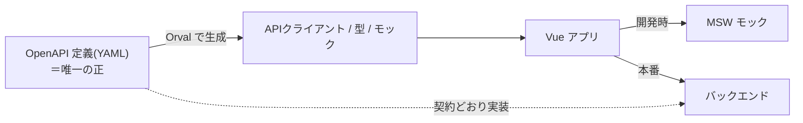

# 04. スキーマ駆動とモック

## ゴール

ShogiProject 最大の特徴である**スキーマ駆動開発**を理解し、Orval + MSW で「API を自動生成・モック」する流れを体験する。AI 駆動開発と特に相性が良い手法です。

## スキーマ駆動とは

普通に開発すると、フロントとバックが別々に作業して**食い違い**が起きます（「フロントは項目 A を送ったが、バックは B を待っていた」）。

スキーマ駆動はこれを防ぎます。

1. **まず API の設計図（OpenAPI = YAML ファイル）を 1 つ作る**。これを「唯一の正（SSOT）」とする
2. **フロント**は、その YAML から API クライアント・型・モックを**自動生成**（手書きしない）
3. **バック**は、その YAML の契約どおりに実装する



> なぜ AI 駆動と相性が良いか：**YAML という 1 つの正しい仕様**があると、AI への指示が「この OpenAPI に従って実装して」で済みます。仕様が言葉で散らばっていると AI も人間も食い違います。**仕様を機械可読な 1 ファイルに集約する**のが肝です。

---

## 自動生成と手書きの「境界」（最重要）

ここが実務で一番混乱します。**何が自動生成で、何を自分（や AI）が書くのか**を明確にします。

| レイヤー | 担当 | 中身 |
|----------|------|------|
| 型定義 | **自動生成** | YAML のスキーマから生成（`*.ts`） |
| API クライアント | **自動生成** | `fetch` で各エンドポイントを叩く関数 |
| モックハンドラ | **自動生成** | パス・メソッド・ステータスを持つ MSW ハンドラ |
| ダミー応答の生成器 | **自動生成** | faker で型に合うランダムデータを作る関数 |
| **どのモックを有効化し、何を返すか** | **手書き** | モックの組み立てと固定レスポンスの指定 |
| **現実的なサンプルデータ** | **手書き** | UI 確認に使う意味のあるデータ |

### 鉄則：生成物は触らない

自動生成されたファイルの先頭には必ずこう書いてあります。

```ts
/**
 * Generated by orval v7.13.2 🍺
 * Do not edit manually.
 */
```

**`Do not edit manually`** = 手で編集してはいけません。編集しても次の `generate:api` で消えます。
**修正したい場合は YAML（元の設計図）を直して再生成**します。

> コメントも生成される：生成物の型に付く `/** タグ ID */` のような説明は、**YAML の `description` がそのまま転記**されたものです。コメントを充実させたければ YAML の `description` を書きます。

---

## モックの「固定」と「ランダム」の使い分け

生成されたモックハンドラは、**引数を渡すかどうか**で挙動が変わります。

```ts
// 何も渡さない → faker のランダム応答（毎回違うダミー）
getGetTagsMockHandler()

// 具体値を渡す → その固定値を返す（UI 確認に使える現実的なデータ）
getGetTagsMockHandler({ tags: [{ tid: 't1', name: '居飛車' }] })
```

**使い分けの方針:**
- 中身を気にしない一覧 → ランダムのまま（手間ゼロ）
- 画面の見た目を確認したい・特定条件を再現したい → 固定値を手書き

ShogiProject の `shogi-main/src/mocks/browser.ts` を見ると、users/tags 系は**ランダムのまま**、棋譜系は**固定データを手書き**で渡す、という使い分けが実際に行われています。

---

## 本番ではモックは消える（同じコード、違う挙動）

「ローカルと本番でコードを分けているのか?」——いいえ、**コードは 1 本**です。分岐するだけです。

```ts
// main.ts（ShogiProject の実パターン）
if (import.meta.env.DEV) {            // 開発時だけ true
  const { worker } = await import('./mocks/browser')
  await worker.start(...)             // モックを起動
}
```

`import.meta.env.DEV` は **Vite がビルド時に定数へ置換**します。

- `npm run dev` → `DEV = true` → モック起動。**バックエンド無しで動く**
- `npm run build` → `DEV = false` → `if (false)` になり、**モック・MSW・faker は本番成果物から丸ごと削除**（tree-shaking）

本番では実際のバックエンドに `fetch` が飛びます。**1 つのコードで、開発はモック・本番は実 API**、を実現しています。

---

## 演習：Orval を体験する

学習用に、最小の OpenAPI から生成を試します。任意のディレクトリで:

```bash
mkdir -p /tmp/orval-demo && cd /tmp/orval-demo
npm init -y
npm install -D orval
npm install @faker-js/faker msw
```

最小の OpenAPI を作ります（`api.yaml`）。1 つの GET エンドポイントだけ:

```yaml
openapi: 3.0.0
info: { title: Demo, version: "1.0.0" }
paths:
  /hello:
    get:
      operationId: getHello
      responses:
        "200":
          description: ok
          content:
            application/json:
              schema:
                type: object
                properties:
                  message: { type: string, description: あいさつ文 }
```

Orval 設定（`orval.config.ts`）:

```ts
import { defineConfig } from 'orval'
export default defineConfig({
  demo: {
    input: { target: './api.yaml' },
    output: {
      target: './generated/api.ts',
      client: 'fetch',
      mock: { type: 'msw' },
    },
  },
})
```

生成:

```bash
npx orval
ls generated/          # api.ts と msw が生成される
```

`generated/` を開いて、**型・クライアント・モック・`Do not edit manually` コメント・`description` の転記**を実際に目で見てください。`api.yaml` の `description` を書き換えて再生成すると、コメントが変わるのも確認できます。

> 完成形の参考は [sample-app/](sample-app/) に置いた設計図とコメントを参照。

---

## ShogiProject ではどうしているか

- 設計図：`Frontend/docs/openapi_main.yaml`（親リポジトリの `docs/` が正で、`docs/sync.sh` で同期）
- 生成先：`shogi-main/src/api/generated/`（`Do not edit manually`、Lint 対象外）
- モック組み立て：`shogi-main/src/mocks/browser.ts`（手書き、固定/ランダム使い分け）
- 起動分岐：`shogi-main/src/main.ts` の `import.meta.env.DEV`

## この章のまとめ

- **YAML を唯一の正**にして、フロントは生成・バックは準拠
- **生成物は触らない。直すなら YAML を直して再生成**
- モックは**固定（手書き）とランダム（生成）を使い分け**
- **同じコードで、開発はモック・本番は実 API**（`DEV` フラグで切替・tree-shaking）

次は [05_auth.md](05_auth.md) で、AI でもつまずきやすい認証・認可を扱います。
